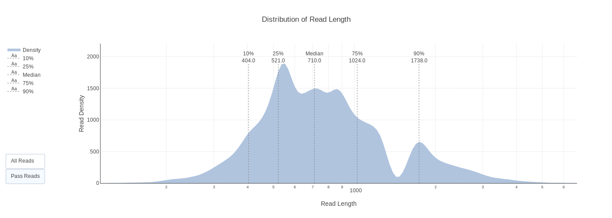
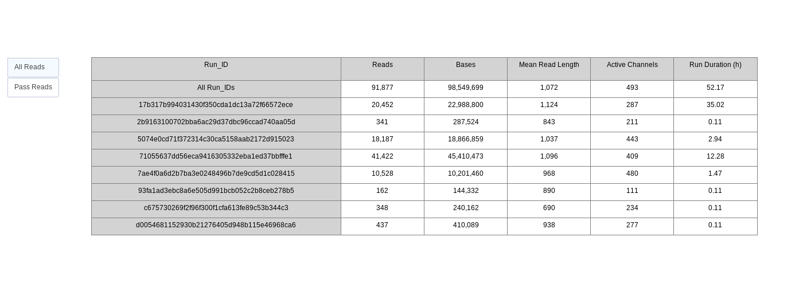
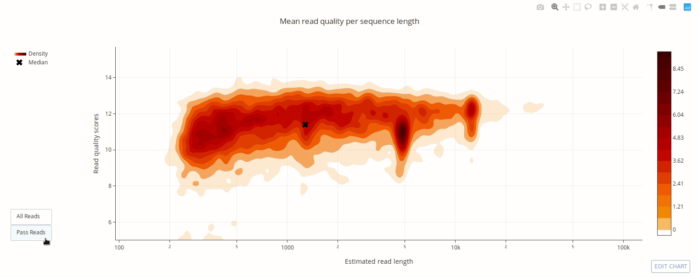
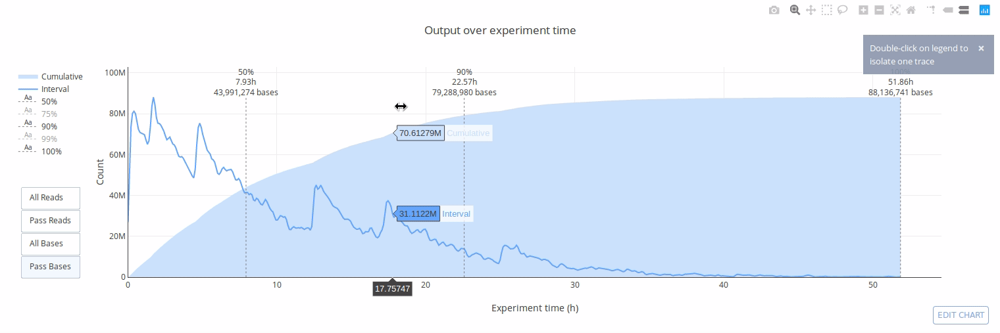
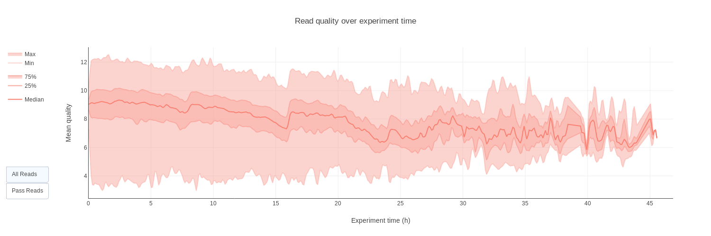

# pycoQC-2

[](https://zenodo.org/badge/latestdoi/94531811)
[](https://github.com/a-slide/pycoQC/blob/master/LICENSE)
[](https://www.python.org/)
[](https://badge.fury.io/py/pycoQC)

---

**pycoQC computes metrics and generates Interactive QC plots from the sequencing
summary report generated by Oxford Nanopore technologies basecaller (Albacore/Guppy)**

As opposed to more exhaustive QC programs for nanopore data, pycoQC is very fast as it relies entirely on the *sequencing_summary.txt* file generated by Albacore and Guppy. Consequently, pycoQC will only provide metrics at read level metrics (and not at base level). The package supports 1D and 1D2 runs generated with Albacore 1.2.1 + or Guppy 2.1.3+.

# Gallery

*Click on picture to see online interactive version.*

[](https://plot.ly/~aleg/2/distribution-of-read-length/)

[](https://plot.ly/~aleg/16/)

[](https://plot.ly/~aleg/3/mean-read-quality-per-sequence-length/)

[](https://plot.ly/~aleg/4/output-per-channel-over-experiment-time/)

[](https://plot.ly/~aleg/5/output-over-experiment-time/)

[](https://plot.ly/~aleg/7/percentage-of-reads-per-barcode/)

[](https://plot.ly/~aleg/6/mean-read-quality-over-experiment-time/)

[](https://plot.ly/~aleg/28/read-length-over-experiment-time/)

# Installation

Ideally, before installation, create a clean **Python 3** virtual environment to deploy the package. **Python 2 is not supported**

For example you can use virtualenvwrapper (see [tutorial](http://www.simononsoftware.com/virtualenv-tutorial-part-2/)).

## Dependencies

pycoQC relies on a few robustly maintained third party libraries (numpy, scipy, pandas, plotly, jinja2). The correct versions of the packages are installed together with the software when using pip.

## Option 1: Direct installation with pip from pipy (recommended)

Install the package with pip3. Python dependencies are automatically installed.

`pip3 install pycoQC`

To update the package:

`pip3 install pycoQC --upgrade`

## Option 2: Clone the repository and install locally in develop mode

With this option, the package will be locally installed in “editable” or “develop” mode. This allows the package to be both installed and editable in project form. This is the recommended option if you wish to modify the code and/or participate to the development of the package. Python dependencies will be automatically installed.

`git clone https://github.com/a-slide/pycoQC.git`

`cd pycoQC`

`chmod u+x setup.py`

`pip3 install -e ./`

# Usage

## Sequencing summary file

pycoQC needs a text summary file generated by ONT Albacore or Guppy. For 1D run use the file named *sequencing_summary.txt* available the root of Albacore output directory. For 1D2, use *sequencing_1dsq_summary.txt* that can be found in the 1dsq_analysis directory.

PycoQC can read compressed sequencing_summary.txt files (‘gzip’, ‘bz2’, ‘zip’, ‘xz’). Instead of a single file, it is also possible to pass a UNIX style regex to match multiple files.

PycoQC requires the following fields in the sequencing.summary file:

* 1D run => read_id, run_id, channel, start_time, sequence_length_template, mean_qscore_template
* 1D2 run => read_id, run_id, channel, start_time, sequence_length_2d, mean_qscore_2d

Depending on the run type and the version of Albacore used some informations might not be available. In particular calibration reads were not flagged in early versions of Albacore. When the field is available those reads are automatically discarded. Similarly barcodes information are only available in multiplexed runs.

### Generating a sequencing summary file from Fast5 files

In case you don'thave access to a summary sequencing file, pycoQC comes with a small utilities to generate such file from a directory containing basecalled fast5 files.  See the Demo notebook bellow for more information on how to generate to file through the python API.

## Interactive usage in Jupyter Notebook

The Jupyter Notebook is a fantastic tool that can be used in many different ways, in particular to share you analyses in an interactive environment with other people.

One of the specificity of pycoQC is to have a rich python API meant to be used directly inside a Jupyter notebook. The pycoQC API for Jupyter is very flexible and allows you to explore your nanopore data interactively and in more depth than with the command line interface.

### Demo notebook

An online live usage notebook served by MyBinder is available to familiarize with the package API:

[](https://mybinder.org/v2/gh/a-slide/pycoQC/master?filepath=docs%2FpycoQC_usage.ipynb) (Can take a few minutes)

A static html version of the same notebook is also available if you experience any issue with the live version:

[](https://a-slide.github.io/pycoQC/pycoQC_usage.html)

### Running your own notebook locally

If you want to run pycoQC interactively in Jupyter you need to install Jupyter manually. If you installed pycoQC in a virtual environment then install Jupyter in the same virtual environment.

`pip3 install notebook`

Launch the notebook in a shell terminal

`jupyter notebook`

If it does not auto-start, open the following URL in you favorite web browser http://localhost:8888/tree

From Jupyter homepage you can navigate to the directory you want to work in and create a new Python3 Notebook.

Then, to analyse your data, follow the instructions given in the example usage notebook.

## Command line interface usage

On top of the interactive interface, pycoQC also comes with a command line interface that can generate a beautiful HTML formatted report.

### Basic pycoQC Usage

`pycoQC -f {path to summary_sequencing file} -o {path to output html report file}`

Example HTML reports generated by pycoQC are available below:

* [DNA_1D Albacore 1.7.0 + barcoding](https://a-slide.github.io/pycoQC/pycoQC_Albacore-1.7.0_basecall-barcode-1D-DNA.html)
* [RNA_1D Albacore 2.1.10](https://a-slide.github.io/pycoQC/pycoQC_Albacore-2.1.10_basecall-1D-RNA.html)
* [DNA_1D Albacore 2.1.10](https://a-slide.github.io/pycoQC/pycoQC_Albacore-2.1.10_basecall-1D-DNA.html)
* [RNA_1D Albacore 2.3.1](https://a-slide.github.io/pycoQC/pycoQC_Albacore-2.3.1_basecall-1D-RNA.html)

pycoQC help can be obtained by using `pycoQC --help`.

```bash
usage: pycoQC [--version] [--file FILE] [--outfile OUTFILE]
              [--min_pass_qual MIN_PASS_QUAL] [--verbose_level {3,2,1}]
              [--config CONFIG] [--template_file TEMPLATE_FILE]
              [--default_config] [--list_plots] [--help]
              [method]

pycoQC computes metrics and generates interactive QC plots from the sequencing
summary report generated by Oxford Nanopore technologies Albacore basecaller

positional arguments:
  method

optional arguments:
  --version, -v         show program's version number and exit
  --file FILE, -f FILE  Path to the sequencing_summary generated by Albacore
                        1.0.0 +. One can also pass a UNIX style regex to match
                        multiple files with glob
                        https://docs.python.org/3.6/library/glob.html
  --outfile OUTFILE, -o OUTFILE
                        Path to the output html file
  --min_pass_qual MIN_PASS_QUAL, -q MIN_PASS_QUAL
                        Minimum quality to consider a read as 'pass'
  --verbose_level {3,2,1}
                        Level of verbosity, from 3 (Chatty) to 1 (Nothing)
  --config CONFIG, -c CONFIG
                        Path to a JSON configuration file. If not provided,
                        looks for it in ~/.pycoQC and ~/.config/pycoQC/config.
                        If it's still not found, falls back to default
                        parameters. The first level keys are the names of the
                        plots to be included. The second level keys are the
                        parameters to pass to each plotting function
  --template_file TEMPLATE_FILE
                        Jinja2 html template
  --default_config, -d  Print default configuration file. Can be used to
                        generate a template JSON file
  --list_plots, -l      Print the list of available plotting functions and
                        exit
  --help, -h            Print a help message and exit. If a plotting function
                        name is also given, print a function specific help
                        message
```

### Advanced pycoQC usage

Although we recommend to stick to the default parameters, a json formatted configuration file can be provided to tweak the plots. A default configuration file can be generated using:

`pycoQC --default_config > default_config.json`

Customizable parameters of plotting functions are usually self explanatory, but more details can be obtained for each plotting function by calling pycoQC `help` with the name of a specific plotting function. For example:

`pycoQC reads_len_1D --help`

### Generating a summary sequencing file 

`Fast5_to_seq_summary -f {path to fast5 dir} -s {path to output summary sequecing file}`

`Fast5_to_seq_summary` help can be obtained by using `Fast5_to_seq_summary --help`.

```bash
usage: Fast5_to_seq_summary [-h] [--version] --fast5_dir FAST5_DIR
                            --seq_summary_fn SEQ_SUMMARY_FN
                            [--max_fast5 MAX_FAST5] [--threads THREADS]
                            [--basecall_id BASECALL_ID] [--fields FIELDS]
                            [--include_path] [--verbose_level VERBOSE_LEVEL]

Fast5_to_seq_summary generate a sequencing summary like file from a directory
containing Fast5 files

optional arguments:
  -h, --help            show this help message and exit
  --version, -v         show program's version number and exit
  --fast5_dir FAST5_DIR, -f FAST5_DIR
                        Directory containing fast5 files. Can contain multiple
                        subdirectories
  --seq_summary_fn SEQ_SUMMARY_FN, -s SEQ_SUMMARY_FN
                        path of the summary sequencing file where to write the
                        data extracted from the fast5 files
  --max_fast5 MAX_FAST5
                        Maximum number of file to try to parse. 0 to
                        deactivate (default: 0)
  --threads THREADS, -t THREADS
                        Total number of threads to use. 1 thread is used for
                        the reader and 1 for the writer. Minimum 3 (default:
                        4)
  --basecall_id BASECALL_ID
                        id of the basecalling group. By default leave to 0,
                        but if you perfome multiple basecalling on the same
                        fast5 files, this can be used to indicate the
                        corresponding group (1, 2 ...) (default: 0)
  --fields FIELDS       list of field names corresponding to attributes to try
                        to fetch from the fast5 files (default: read_id run_id
                        channel start_time sequence_length_template
                        mean_qscore_template
                        calibration_strand_genome_template
                        barcode_arrangement)
  --include_path        If given, the absolute path to the corresponding file
                        is added in an extra column (default: False)
  --verbose_level VERBOSE_LEVEL
                        Level of verbosity, from 2 (Chatty) to 0 (Nothing)
                        (default: 0)
```

# Note to power-users and developers

Please be aware that pycoQC is a research package that is still under development. It was tested under Linux Ubuntu 16.04 and in an HPC environment running under Red Hat Enterprise 7.1.

You are welcome to contribute by requesting additional functionalities, reporting bugs or by forking and submitting pull requests

Thank you

### Authors

* Adrien Leger - aleg {at} ebi.ac.uk
* Tommaso Leonardi - tom {at} tleo.io
