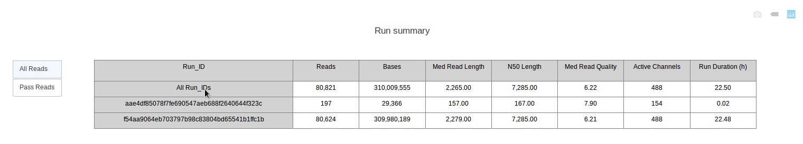
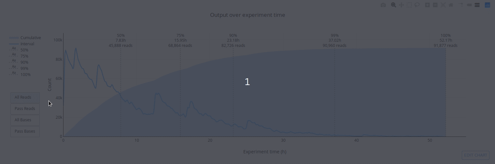
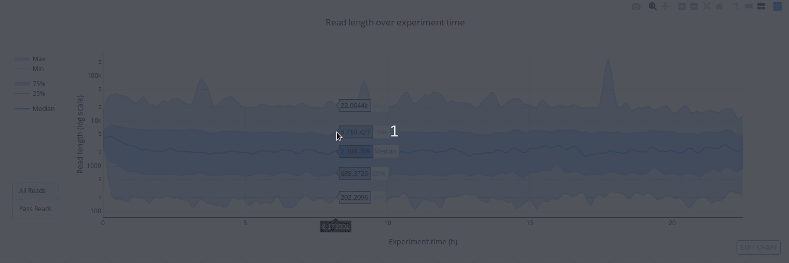
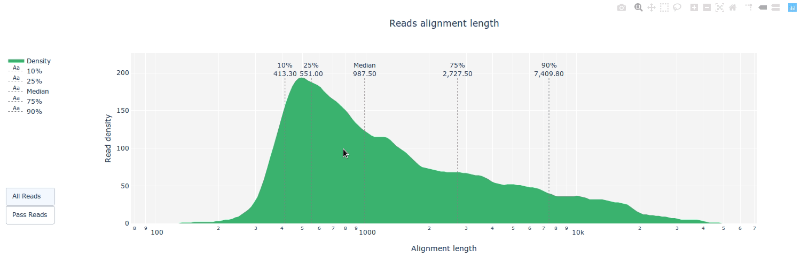
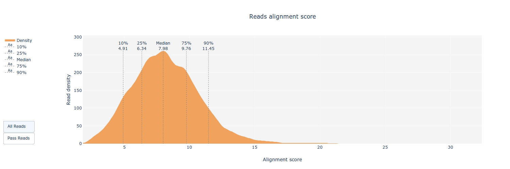
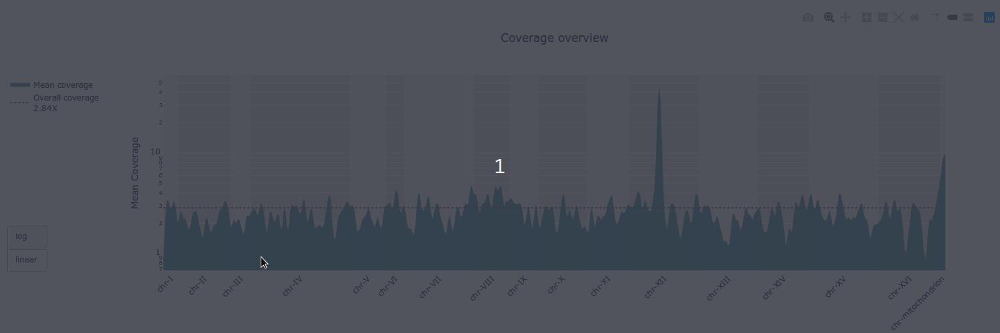
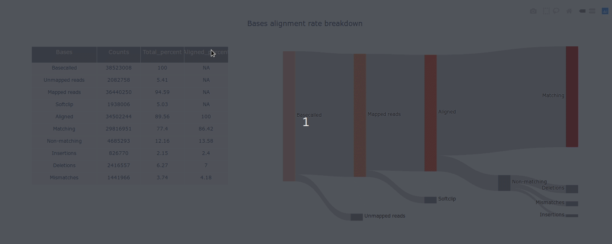

---

**Full documentation is available at https://a-slide.github.io/pycoQC/**

---

**PycoQC computes metrics and generates interactive QC plots for Oxford Nanopore technologies sequencing data**

PycoQC relies on the *sequencing_summary.txt* file generated by Albacore and Guppy, but if needed it can also generates a summary file from basecalled fast5 files. The package supports 1D and 1D2 runs generated with Minion, Gridion and Promethion devices and basecalled with Albacore 1.2.1+ or Guppy 2.1.3+. PycoQC is written in pure Python3. **Python 2 is not supported**.

## Gallery

]

]

## Example HTML reports

* [Albacore_all_RNA](https://a-slide.github.io/pycoQC/pycoQC/results/Albacore_all_RNA.html)

* [Guppy-2.1.3_basecall-1D_RNA](https://a-slide.github.io/pycoQC/pycoQC/results/Guppy-2.1.3_basecall-1D_RNA.html)

* [Guppy-2.3_basecall-1D_alignment-DNA](https://a-slide.github.io/pycoQC/pycoQC/results/Guppy-2.3_basecall-1D_alignment-DNA.html)

* [Albacore-1.2.1_basecall-1D-DNA](https://a-slide.github.io/pycoQC/pycoQC/results/Albacore-1.2.1_basecall-1D-DNA.html)

* [Guppy-2.1.3_basecall-1D_DNA_barcode](https://a-slide.github.io/pycoQC/pycoQC/results/Guppy-2.1.3_basecall-1D_DNA_barcode.html)

* [Albacore-1.7.0_basecall-1D-DNA_API](https://a-slide.github.io/pycoQC/pycoQC/results/Albacore-1.7.0_basecall-1D-DNA_API.html)

* [Albacore-2.1.10_basecall-1D-DNA](https://a-slide.github.io/pycoQC/pycoQC/results/Albacore-2.1.10_basecall-1D-DNA.html)

* [Albacore-1.7.0_basecall-1D-DNA](https://a-slide.github.io/pycoQC/pycoQC/results/Albacore-1.7.0_basecall-1D-DNA.html)

## Example JSON reports

* [Guppy-2.3_basecall-1D_alignment-DNA](https://a-slide.github.io/pycoQC/pycoQC/results/Guppy-2.3_basecall-1D_alignment-DNA.json)

* [Guppy-2.1.3_basecall-1D_RNA](https://a-slide.github.io/pycoQC/pycoQC/results/Guppy-2.1.3_basecall-1D_RNA.json)

* [Albacore-1.7.0_basecall-1D-DNA_API](https://a-slide.github.io/pycoQC/pycoQC/results/Albacore-1.7.0_basecall-1D-DNA_API.json)

## Authors

* Adrien Leger - aleg {at} ebi.ac.uk

* Tommaso Leonardi - tom {at} tleo.io
