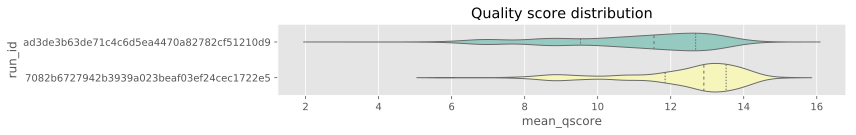
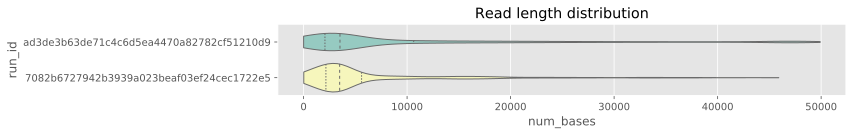
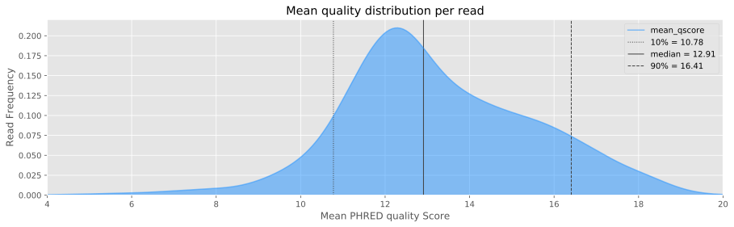
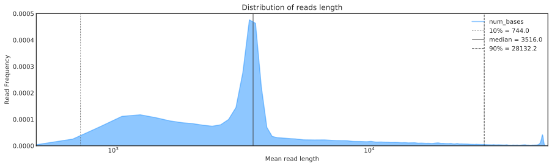
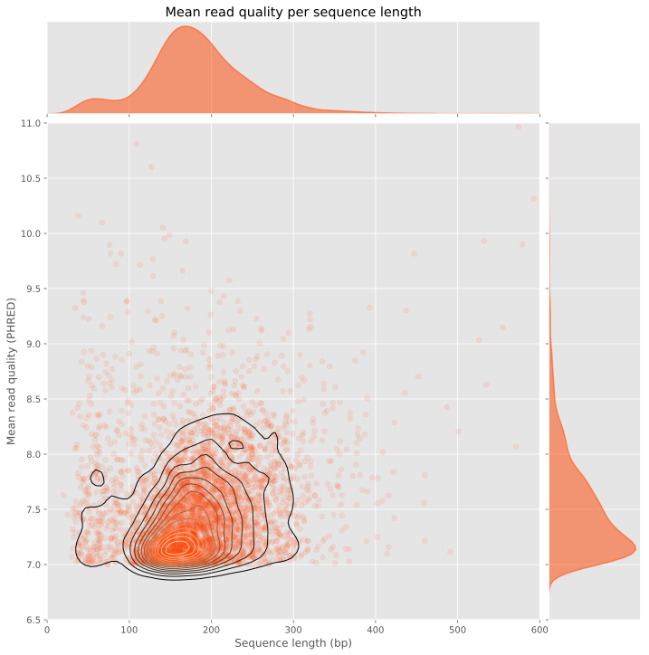
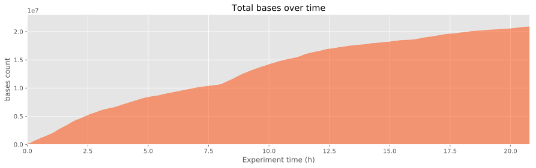
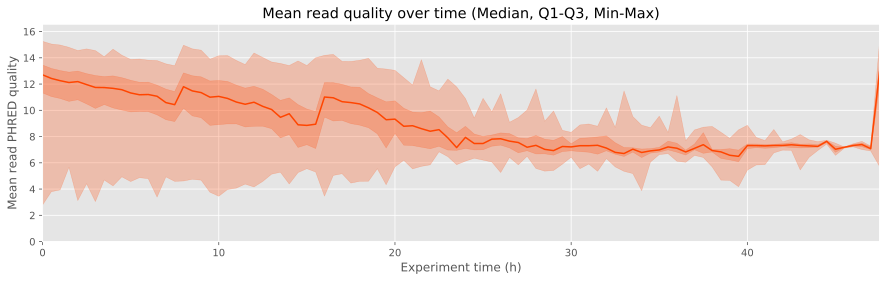
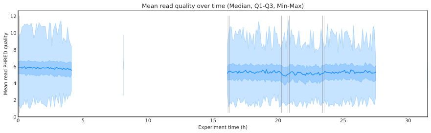
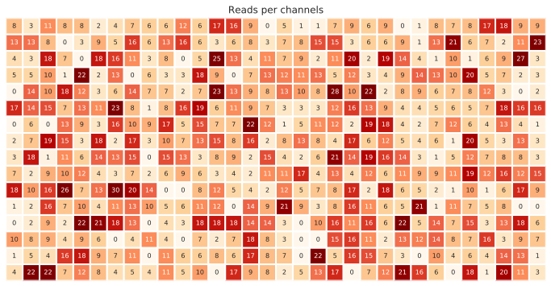
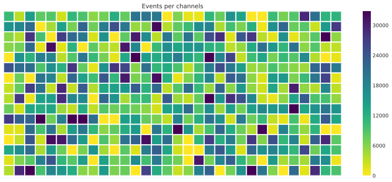

# pycoQC 1.1a1 package documentation

---

**
PycoQC is a Python 3 package for Jupyter Notebook, computing metrics and generating simple QC plots
from the sequencing summary report generated by Oxford Nanopore technologies **Albacore basecaller**
**

---

pycoQC is a very simple quality control package for Nanopore data written in pure **python3**, meant
to be used directly in a **jupyter notebook** 4.0.0 +. As opposed to more exhaustive QC programs for nanopore
data, pycoQC is very fast as it relies entirely on the *sequencing_summary.txt* file generated by ONT Albacore
Sequencing Pipeline Software 1.2.1+, during base calling. Consequently, pycoQC will only provide metrics at read level
metrics (and not at base level). The package supports 1D and 1D2 runs analysed with Albacore.

PycoQC requires the following fields in the sequencing.summary.txt file:

* 1D run => **read_id**, **run_id**, **channel**, **start_time**, **sequence_length_template**, **mean_qscore_template**
* 1D2 run =>**read_id**, **run_id**, **channel**, **start_time**, **sequence_length_2d**, **mean_qscore_2d**

In addition it will try to get the following optional fields if they are available:

* **num_events**, **calibration_strand_genome_template**, **passes_filtering**

---

* Author: Adrien Leger - aleg@ebi.ac.uk

* URL: https://github.com/a-slide/pycoQC

* Licence: GPLv3

* Python version: >=3.3

<style>.container { width:80% !important; }</style>

# Installation

Ideally, before installation, create a clean python3 virtual environment to deploy the package, using virtualenvwrapper for example (see http://www.simononsoftware.com/virtualenv-tutorial-part-2/).

## Required packages:

* numpy>=1.13.0

* pandas>=0.20.0

* matplotlib>=2.0.0

* seaborn>= 0.7.0

* notebook>=4.0.0

## Option 1: Direct installation with pip from github (recommended)

Install the package with pip3. All the required dependencies will be automatically installed.

`pip3 install git+https://github.com/a-slide/pycoQC.git`
   
To update the package:

`pip3 install git+https://github.com/a-slide/pycoQC.git --upgrade`
    

## Option 2: Clone the repository and install locally in develop mode

With this option, the package will be locally installed in “editable” or “develop” mode. This allows the package to be both installed and editable in project form. This is the recommended option if you wish to participate to the development of the package. As for the option before, the required dependencies will be automatically installed.

`git clone https://github.com/a-slide/pycoQC.git`

`cd pycoQC`

`chmod u+x setup.py`

`pip3 install -e ./`

With this option you can also run the testing notebook located in the source directory *pycoQC/test_pycoQC.ipynb*

## Option 3: Local installation without pip (not recommended)

This option is also suitable if you are interested in further developing the package, but requires a little bit more hands-on.

Clone the repository locally

`git clone https://github.com/a-slide/pycoQC.git`
    
* Add the package directory (./pycoQC/pycoQC) to you python3 PATH (depending on you OS and whether you want it to be permanent ot not)

* Install the dependencies (numpy, pandas, matplotlib, seaborn and notebook)

`pip3 install numpy pandas matplotlib seaborn notebook`

# Usage

The package is meant to be used in a jupyter notebook 4.0.0 +

### Running jupyter in a virtualenv (optional)

If you installed the package in a virtual environment with virtualenvwrapper, jupyter can run the virtualenv as a kernel as explained here http://help.pythonanywhere.com/pages/IPythonNotebookVirtualenvs

## Notebook setup

Launch the notebook in a terminal

`jupyter notebook`

If it does not autolaunch your web browser, open manually the following URL http://localhost:8888/tree

From Jupyter home page you can navigate to the directory you want to work in. Then, create a new Python3 Notebook.

In the notebook, import matplotlib and use the jupyter magic command to enable direct plotting in the current Notebook. I also recommend to use the svg format as a backend for matplotlib.

```python
import matplotlib.pyplot as pl
%matplotlib inline
%config InlineBackend.figure_format = 'svg'
```

One can also tweak the pandas output to enlarge the dataframes for the tabular data generated by pycoQC

```python
import pandas as pd
pd.options.display.max_colwidth = 200
```

Default pylab parameters can be defined at the beginning of the notebook as well (see http://matplotlib.org/users/customizing.html for more options)

```python
pl.rcParams['figure.figsize'] = 20,7
pl.rcParams['font.family'] = 'sans-serif'
pl.rcParams['font.sans-serif'] = ['DejaVu Sans']
```

## General package information

pycoQC is a simple class that is initialized with a sequencing_summary file generated by Albacore 1.2.1 +.

The instantiated object can be subsequently called with various methods that will generates tables and plots

Each function has specific options that are comprehensively detailed in the test notebook provided with the package or in directly on Github: [Test_notebook](https://github.com/a-slide/pycoQC/blob/master/pycoQC/test_pycoQC.ipynb)

Most of the plotting functions return a matplotlib fig, ax tuple. This allows users to further customize the plotting areas thanks to the numerous set methods associated with the object (for instance Axes.set_axis_off, Axes.set_xlim, Axes.set_xscale...). 
Extensive information is available in the Matplotlib API documentation: http://matplotlib.org/api/axes_api.html.

All the plotting functions can take a [matplotlib "style"](https://matplotlib.org/users/style_sheets.html) option. To list all available styles in your environment, use:

```python
print(pl.style.available)
```

    ['seaborn-talk', 'dark_background', 'seaborn-white', 'seaborn', 'seaborn-dark', 'seaborn-whitegrid', 'fivethirtyeight', 'seaborn-notebook', 'seaborn-darkgrid', 'seaborn-dark-palette', 'seaborn-bright', 'Solarize_Light2', 'seaborn-muted', 'seaborn-colorblind', 'grayscale', 'fast', 'seaborn-paper', 'seaborn-pastel', '_classic_test', 'seaborn-poster', 'seaborn-ticks', 'bmh', 'seaborn-deep', 'classic', 'ggplot']

## Import the package

```python
from pycoQC.pycoQC import pycoQC
```

One can also import the jprint and jhelp function from pycoQC to get a improve the default print and help function in jupyter.

```python
from pycoQC.pycoQC_fun import jhelp, jprint
```

*jhelp* Can be used to provide a full description of the pycoQC functions using the *full* option.

```python
jhelp(pycoQC.reads_qual_bins, full=True)
```

<b>reads_qual_bins</b> (self, bins=[-1, 0, 2, 4, 6, 8, 10, 12, 14, 16, 18, 20, 40])

Count the number of reads per interval of sequence quality and return a dataframe

* bins: LIST [Default [-1,0,2,4,6,8,10,12,14,16,18,20,40]]

Limits of the intervals as a list

 Or alternatively one can also use the jupyter magic "?" 

```python
?pycoQC.reads_qual_bins
```

A sample test file previously generated by Albacore are provided with the package. They can be listed using the following function

```python
df = pycoQC.example_data_files()
display(df)
```

<div>
<table border="1" class="dataframe">
  <thead>
    <tr style="text-align: right;">
      <th></th>
      <th>path</th>
      <th>description</th>
    </tr>
  </thead>
  <tbody>
    <tr>
      <th>1D_DNA_1.2.1</th>
      <td>/home/aleg/Programming/Python3/pycoQC/pycoQC/d...</td>
      <td>Sequencing summary file generated by a 1D_DNA ...</td>
    </tr>
    <tr>
      <th>1D_RNA_2.0.1</th>
      <td>/home/aleg/Programming/Python3/pycoQC/pycoQC/d...</td>
      <td>Sequencing summary file generated by a 1D_RNA ...</td>
    </tr>
    <tr>
      <th>1D2_DNA_1.2.1</th>
      <td>/home/aleg/Programming/Python3/pycoQC/pycoQC/d...</td>
      <td>Sequencing summary file generated by a 1D2_DNA...</td>
    </tr>
  </tbody>
</table>
</div>

I recommend using of of theses files to test pycoQC, but you can obviously use your own files instead

## Initialize pycoCQ

```python
jhelp (pycoQC.__init__)
```

<b>__init__</b> (self, seq_summary_file, run_type='', runid_list=[], filter_zero_len=False, filter_fail=False, filter_calibration=False, verbose=False, **kwargs)

Parse Albacore sequencing_summary.txt file and clean-up the data

### Basic initialization

```python
p = pycoQC("/home/aleg/Programming/Python3/pycoQC/pycoQC/data/sequencing_summary_1D_DNA_Albacore_1.2.1.txt", verbose=True)
```

<p><b>Importing data</b></p>

<p>&emsp;50000 reads found in initial file</p>

<p><b>Verify and rearrange fields</b></p>

<p>&emsp;1D Run type</p>

<p><b>Order run IDs by start time</b></p>

<p>&emsp;Processing reads with Run_ID ad3de3b63de71c4c6d5ea4470a82782cf51210d9</p>

<p>&emsp;Processing reads with Run_ID 7082b6727942b3939a023beaf03ef24cec1722e5</p>

<p><b>Reindex and sort</b></p>

<p>&emsp;50000 Total valid reads found</p>

### Initialization with runids reordering

If several runids are present in the file, pycoQC will order the runids bases on their order in the file, which does not always correspond to the sequencing order. Unfortunately their is no way to know the right order based on the information contained in the *sequencing_summary.txt* file alone. However if you know the order you can specify it at initialisation (or even  exclude specific runids).

```python
runid_list = ["7082b6727942b3939a023beaf03ef24cec1722e5", "ad3de3b63de71c4c6d5ea4470a82782cf51210d9"]
p = pycoQC("/home/aleg/Programming/Python3/pycoQC/pycoQC/data/sequencing_summary_1D_DNA_Albacore_1.2.1.txt", runid_list=runid_list, verbose=True)
```

<p><b>Importing data</b></p>

<p>&emsp;50000 reads found in initial file</p>

<p><b>Verify and rearrange fields</b></p>

<p>&emsp;1D Run type</p>

<p><b>Order run IDs by start time</b></p>

<p>&emsp;Processing reads with Run_ID 7082b6727942b3939a023beaf03ef24cec1722e5</p>

<p>&emsp;Processing reads with Run_ID ad3de3b63de71c4c6d5ea4470a82782cf51210d9</p>

<p><b>Reindex and sort</b></p>

<p>&emsp;50000 Total valid reads found</p>

### Initialization with read filtering 

Some reads are not "basecallable" and consequently have a length of zero. These reads can be filtered out with the option *filter_zero_len*.

Starting from Albacore 2.0, ONT introduced additional fields in the *sequencing_summary.txt* to flag sequences that did not meet the quality requirements and sequences aligned on the internal control. These sequences can be filtered out with the options *filter_calibration* and *filter_fail*.

```python
p = pycoQC("/home/aleg/Programming/Python3/pycoQC/pycoQC/data/sequencing_summary_1D_RNA_Albacore_2.0.1.txt", filter_calibration=True, filter_fail=True, filter_zero_len=True, verbose=True)
```

<p><b>Importing data</b></p>

<p>&emsp;50000 reads found in initial file</p>

<p><b>Verify and rearrange fields</b></p>

<p>&emsp;1D Run type</p>

<p><b>Filter out failed reads</b></p>

<p>&emsp;45462 reads discarded</p>

<p><b>Filter out reads corresponding to the calibration strand</b></p>

<p>&emsp;125 reads discarded</p>

<p><b>Filter out zero length reads</b></p>

<p>&emsp;0 reads discarded</p>

<p><b>Order run IDs by start time</b></p>

<p>&emsp;Processing reads with Run_ID 3a0ea63a73db0f9fb611b9da3a37045d249a9be0</p>

<p>&emsp;Processing reads with Run_ID 2f4d52a34ec56518aa0d051dc4484c2b454abc6a</p>

<p>&emsp;Processing reads with Run_ID e7d9b3c6bb26250ffaf1f8be9d2d1ae0105204b9</p>

<p>&emsp;Processing reads with Run_ID f6d788dc15a52f5bbb736aa82c5dee7b9c50d63f</p>

<p>&emsp;Processing reads with Run_ID 5db3f3d44b7ce2c468a7d786060fe39e59282240</p>

<p>&emsp;Processing reads with Run_ID a175388e5c1ed0e6a78791f120de1c9efcb46b43</p>

<p>&emsp;Processing reads with Run_ID b4013533403ec7bbe89d2e9e4021d06c69fe6cf5</p>

<p>&emsp;Processing reads with Run_ID 135e6b0c7d4223d4047216f10bede4ca5a84eb28</p>

<p>&emsp;Processing reads with Run_ID 7e95428dd57055c0665696cce1bffc73fd5b5d29</p>

<p>&emsp;Processing reads with Run_ID aa23fdac499ddcbe80b86a240ee2e803f39d62ea</p>

<p><b>Reindex and sort</b></p>

<p>&emsp;4413 Total valid reads found</p>

## Generate an overview of the data

```python
jhelp(pycoQC.overview)
```

<b>overview</b> (self, cmap='Set3', plot_style='ggplot')

Generate a quick overview of the data (tables + plots)

```python
## You don't need to initialize pycoQC every times. But for this tutorial I will do it to show the output obtained with different example files
p = pycoQC("/home/aleg/Programming/Python3/pycoQC/pycoQC/data/sequencing_summary_1D_DNA_Albacore_1.2.1.txt")
g = p.overview (cmap='Set3', plot_style='ggplot')
```

<p><b>Overall counts</b></p>

<div>
<table border="1" class="dataframe">
  <thead>
    <tr style="text-align: right;">
      <th></th>
      <th>Count</th>
    </tr>
  </thead>
  <tbody>
    <tr>
      <th>Reads</th>
      <td>5.000000e+04</td>
    </tr>
    <tr>
      <th>Bases</th>
      <td>4.598551e+08</td>
    </tr>
    <tr>
      <th>Events</th>
      <td>8.422545e+08</td>
    </tr>
    <tr>
      <th>Active Channels</th>
      <td>5.070000e+02</td>
    </tr>
    <tr>
      <th>Run Duration (h)</th>
      <td>4.779043e+01</td>
    </tr>
  </tbody>
</table>
</div>

<p><b><br>Read count per Run ID</b></p>

<div>
<table border="1" class="dataframe">
  <thead>
    <tr style="text-align: right;">
      <th></th>
      <th>reads</th>
    </tr>
  </thead>
  <tbody>
    <tr>
      <th>ad3de3b63de71c4c6d5ea4470a82782cf51210d9</th>
      <td>49603</td>
    </tr>
    <tr>
      <th>7082b6727942b3939a023beaf03ef24cec1722e5</th>
      <td>397</td>
    </tr>
  </tbody>
</table>
</div>

<p><b><br>Distribution of quality scores and read lengths</b></p>

<div>
<table border="1" class="dataframe">
  <thead>
    <tr style="text-align: right;">
      <th></th>
      <th>Quality score distribution</th>
      <th>Read length distribution</th>
    </tr>
  </thead>
  <tbody>
    <tr>
      <th>count</th>
      <td>50000.000000</td>
      <td>50000.000000</td>
    </tr>
    <tr>
      <th>mean</th>
      <td>11.018961</td>
      <td>9197.102300</td>
    </tr>
    <tr>
      <th>std</th>
      <td>2.093471</td>
      <td>12475.543239</td>
    </tr>
    <tr>
      <th>min</th>
      <td>2.784000</td>
      <td>5.000000</td>
    </tr>
    <tr>
      <th>10%</th>
      <td>7.720000</td>
      <td>744.000000</td>
    </tr>
    <tr>
      <th>25%</th>
      <td>9.546000</td>
      <td>2067.000000</td>
    </tr>
    <tr>
      <th>50%</th>
      <td>11.552000</td>
      <td>3516.000000</td>
    </tr>
    <tr>
      <th>75%</th>
      <td>12.692000</td>
      <td>10581.250000</td>
    </tr>
    <tr>
      <th>90%</th>
      <td>13.316000</td>
      <td>28132.200000</td>
    </tr>
    <tr>
      <th>max</th>
      <td>15.255000</td>
      <td>49902.000000</td>
    </tr>
  </tbody>
</table>
</div>

<p><b><br>Distributions per run IDs</b></p>





## Analyse the mean read quality distribution

pycoQC can generate a mean read quality score as a Dataframe or as a kernel density distribution plot

### reads_qual_bins

```python
jhelp(pycoQC.reads_qual_bins)
```

<b>reads_qual_bins</b> (self, bins=[-1, 0, 2, 4, 6, 8, 10, 12, 14, 16, 18, 20, 40])

Count the number of reads per interval of sequence quality and return a dataframe

```python
## Again you don't need to initialize pycoQC every times. But if you missed it before, for this tutorial I will do it to show the output obtained with different example files
p = pycoQC("/home/aleg/Programming/Python3/pycoQC/pycoQC/data/sequencing_summary_1D2_DNA_Albacore_1.2.1.txt", filter_zero_len=True)
p.reads_qual_bins( bins=[0, 2, 4, 6, 8, 10, 12, 14, 16, 18, 20, 40])
```

<div>
<table border="1" class="dataframe">
  <thead>
    <tr style="text-align: right;">
      <th></th>
      <th>Count</th>
    </tr>
    <tr>
      <th>Sequence quality ranges</th>
      <th></th>
    </tr>
  </thead>
  <tbody>
    <tr>
      <th>(0, 2]</th>
      <td>0</td>
    </tr>
    <tr>
      <th>(2, 4]</th>
      <td>1</td>
    </tr>
    <tr>
      <th>(4, 6]</th>
      <td>36</td>
    </tr>
    <tr>
      <th>(6, 8]</th>
      <td>104</td>
    </tr>
    <tr>
      <th>(8, 10]</th>
      <td>385</td>
    </tr>
    <tr>
      <th>(10, 12]</th>
      <td>2420</td>
    </tr>
    <tr>
      <th>(12, 14]</th>
      <td>3606</td>
    </tr>
    <tr>
      <th>(14, 16]</th>
      <td>2100</td>
    </tr>
    <tr>
      <th>(16, 18]</th>
      <td>1112</td>
    </tr>
    <tr>
      <th>(18, 20]</th>
      <td>209</td>
    </tr>
    <tr>
      <th>(20, 40]</th>
      <td>2</td>
    </tr>
  </tbody>
</table>
</div>

### reads_qual_distribution

```python
jhelp(pycoQC.reads_qual_distribution)
```

<b>reads_qual_distribution</b> (self, figsize=[30, 7], color='orangered', alpha=0.5, bandwith=0.1, sample=100000, min_qual=0, max_qual=None, min_freq=0, max_freq=None, plot_style='ggplot', **kwargs)

Plot the univariate kernel density estimate of mean read quality

```python
p = pycoQC("/home/aleg/Programming/Python3/pycoQC/pycoQC/data/sequencing_summary_1D2_DNA_Albacore_1.2.1.txt", filter_zero_len=True)
g = p.reads_qual_distribution (figsize=[15, 4], color='dodgerblue', alpha=0.5, bandwith=0.5, sample=100000, min_qual=4, max_qual=20, plot_style='ggplot', )
```



## Analyse the read length distribution

Similarly pycoQC can also compute the read length distribution as a Dataframe or as a kernel density distribution plot

### reads_len_bins

```python
jhelp(pycoQC.reads_len_bins)
```

<b>reads_len_bins</b> (self, bins=[-1, 0, 25, 50, 100, 500, 1000, 5000, 10000, 100000, 10000000])

Count the number of reads per interval of sequence length and return a dataframe

```python
p = pycoQC("/home/aleg/Programming/Python3/pycoQC/pycoQC/data/sequencing_summary_1D_DNA_Albacore_1.2.1.txt", filter_zero_len=True)
p.reads_len_bins(bins=[0, 10, 25, 50, 100, 500, 1000, 5000, 10000, 100000, 10000000])
```

<div>
<table border="1" class="dataframe">
  <thead>
    <tr style="text-align: right;">
      <th></th>
      <th>Count</th>
    </tr>
    <tr>
      <th>Sequence lenght ranges</th>
      <th></th>
    </tr>
  </thead>
  <tbody>
    <tr>
      <th>(0, 10]</th>
      <td>27</td>
    </tr>
    <tr>
      <th>(10, 25]</th>
      <td>50</td>
    </tr>
    <tr>
      <th>(25, 50]</th>
      <td>65</td>
    </tr>
    <tr>
      <th>(50, 100]</th>
      <td>152</td>
    </tr>
    <tr>
      <th>(100, 500]</th>
      <td>2172</td>
    </tr>
    <tr>
      <th>(500, 1000]</th>
      <td>4705</td>
    </tr>
    <tr>
      <th>(1000, 5000]</th>
      <td>25188</td>
    </tr>
    <tr>
      <th>(5000, 10000]</th>
      <td>4705</td>
    </tr>
    <tr>
      <th>(10000, 100000]</th>
      <td>12936</td>
    </tr>
    <tr>
      <th>(100000, 10000000]</th>
      <td>0</td>
    </tr>
  </tbody>
</table>
</div>

### reads_len_distribution

```python
jhelp(pycoQC.reads_len_distribution)
```

<b>reads_len_distribution</b> (self, figsize=[30, 7], color='orangered', alpha=0.5, bandwith=None, sample=100000, min_len=0, max_len=None, min_freq=0, max_freq=None, xlog=False, ylog=False, plot_style='ggplot', **kwargs)

Plot the univariate kernel density estimate of read length in base pairs

```python
p = pycoQC("/home/aleg/Programming/Python3/pycoQC/pycoQC/data/sequencing_summary_1D_RNA_Albacore_2.0.1.txt", filter_zero_len=True, filter_calibration=True, filter_fail=True)
fig, ax = p.reads_len_distribution(figsize=[15,4], color='green', alpha=0.5, min_len=0, max_len=600, plot_style='ggplot')
```


```python
p = pycoQC("/home/aleg/Programming/Python3/pycoQC/pycoQC/data/sequencing_summary_1D_DNA_Albacore_1.2.1.txt", filter_zero_len=True)
fig, ax = p.reads_len_distribution(figsize=[15,4], color='dodgerblue', alpha=0.5, min_len=500, xlog=True, plot_style='seaborn-white')
```



## Generate a 2D distribution of read length and mean quality score

```python
jhelp(pycoQC.reads_len_quality)
```

<b>reads_len_quality</b> (self, figsize=12, kde=True, scatter=True, margin_plot=True, kde_cmap='copper', scatter_color='orangered', margin_plot_color='orangered', kde_alpha=1, scatter_alpha=0.01, margin_plot_alpha=0.5, sample=100000, kde_levels=10, kde_shade=False, min_len=None, max_len=None, min_qual=None, max_qual=None, plot_style='ggplot', **kwargs)

Draw a bivariate plot of read length vs mean read quality with marginal univariate plots.

```python
p = pycoQC("/home/aleg/Programming/Python3/pycoQC/pycoQC/data/sequencing_summary_1D_RNA_Albacore_2.0.1.txt", filter_calibration=True, filter_fail=True, filter_zero_len=True)
g = p.reads_len_quality (figsize=10, kde=True, scatter=True, margin_plot=True, kde_levels=15, min_len=0, max_len=600, min_qual=6.5, max_qual=11, scatter_alpha=0.1)
```



## Analyse the reads/bases/events output over the time of the run

```python
jhelp(pycoQC.output_over_time)
```

<b>output_over_time</b> (self, level='reads', figsize=[30, 7], runid_lines=True, color='orangered', alpha=0.5, bin_size=240, bin_smothing=3, cumulative=False, sample=100000, plot_style='ggplot', **kwargs)

Plot the output over the time of the experiment at read, base or event level

```python
p = pycoQC("/home/aleg/Programming/Python3/pycoQC/pycoQC/data/sequencing_summary_1D_DNA_Albacore_1.2.1.txt", filter_zero_len=True)
g = p.output_over_time(level='bases', figsize=[15, 4], bin_size=240, bin_smothing=5)
```


```python
p = pycoQC("/home/aleg/Programming/Python3/pycoQC/pycoQC/data/sequencing_summary_1D2_DNA_Albacore_1.2.1.txt", filter_zero_len=True)
g = p.output_over_time(level='bases', figsize=[15, 4], color='orangered', cumulative=True)
```



## Analyse the evolution of the mean read quality over the time of the run

```python
jhelp(pycoQC.quality_over_time)
```

<b>quality_over_time</b> (self, runid_lines=True, figsize=[30, 7], color='orangered', alpha=0.25, win_size=0.25, plot_style='ggplot', **kwargs)

Plot the evolution of the mean read quality over the time of the experiment

```python
p = pycoQC("/home/aleg/Programming/Python3/pycoQC/pycoQC/data/sequencing_summary_1D_DNA_Albacore_1.2.1.txt", filter_zero_len=True)
g = p.quality_over_time(figsize=[15, 4], win_size=0.5)
```



```python
p = pycoQC("/home/aleg/Programming/Python3/pycoQC/pycoQC/data/sequencing_summary_1D_RNA_Albacore_2.0.1.txt", filter_zero_len=True)
g = p.quality_over_time(runid_lines=True, figsize=[15, 4], color='dodgerblue', win_size=0.1, plot_style='seaborn-white')
```



## Overview of the activity of flowcell channels

```python
jhelp(pycoQC.channels_activity)
```

<b>channels_activity</b> (self, level='reads', figsize=[24, 12], cmap='OrRd', alpha=1, robust=True, annot=True, fmt='d', cbar=False, plot_style='seaborn-white', **kwargs)

Plot the activity of channels at read, base or event level. The layout does not represent the physical layout

of the flowcell based on seaborn heatmap funtion

```python
p = pycoQC("/home/aleg/Programming/Python3/pycoQC/pycoQC/data/sequencing_summary_1D_RNA_Albacore_2.0.1.txt", filter_zero_len=True, filter_fail=True)
g = p.channels_activity(level='reads', figsize=[12,6])
```



```python
p = pycoQC("/home/aleg/Programming/Python3/pycoQC/pycoQC/data/sequencing_summary_1D_RNA_Albacore_2.0.1.txt", filter_zero_len=True, filter_fail=True)
g = p.channels_activity(level='events', cmap="viridis_r", cbar=True, annot=False, figsize=[15,6])
```



# Note to power-users and developers

Please be aware that pycoQC is an experimental package that is still under development. It was tested under Linux Ubuntu 16.04 and in an HPC environment running under Red Hat Enterprise 7.1.

You are welcome to contribute by requesting additional functionalities, reporting bugs or by forking and submitting patches or updates pull requests

Thank you

### Contributors

Jon Sanders [Github](https://github.com/tanaes)

### Acknowledgments

Thanks to [Kim Judge](https://twitter.com/kim_judge_) for providing a few example sequencing summary files.
