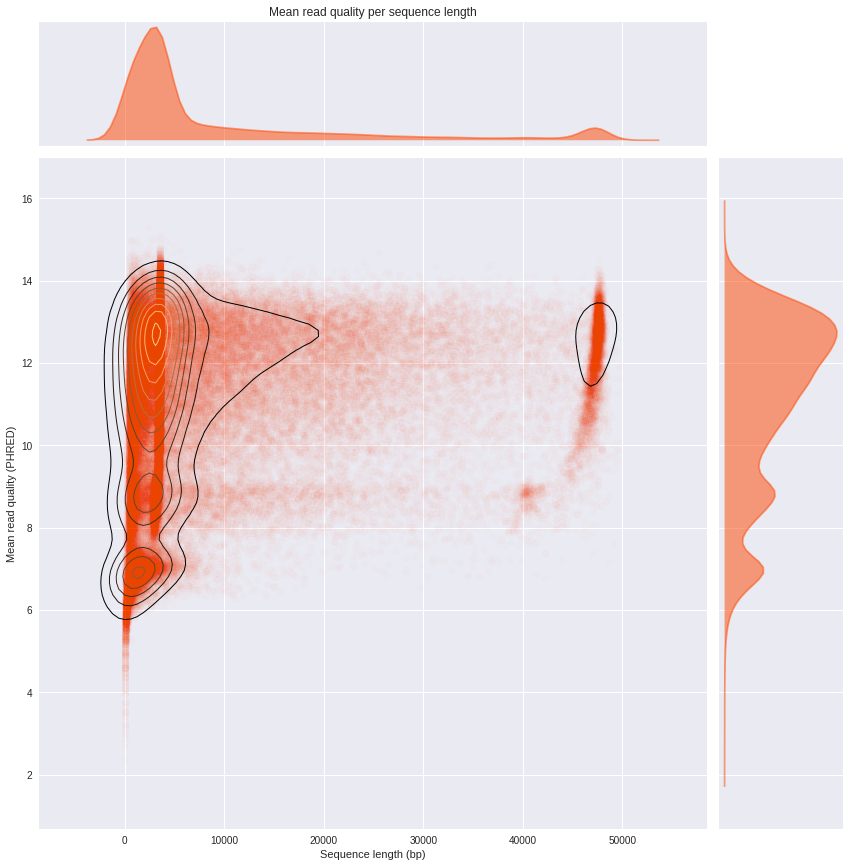
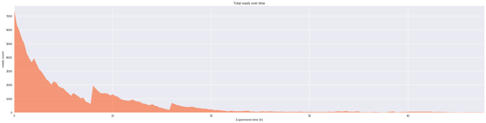
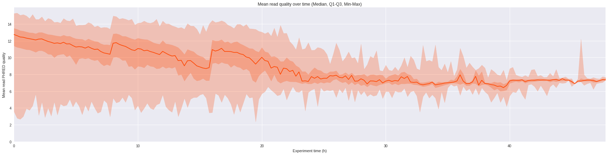
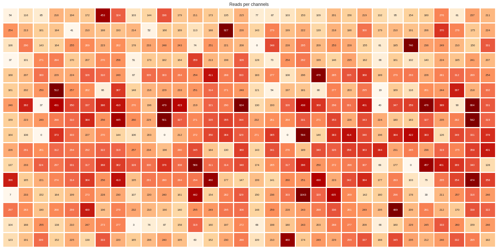

# pycoQC

___
**pycoQC is a Python 3 package for Jupyter Notebook, computing metrics and generating simple QC plots from Oxford Nanopore technologies (ONT) Albacore basecaller**
___

pycoQC is a very simple quality control package for Nanopore data written in pure python3, meant to be used directly in a jupyter notebook 4.0.0 +. As opposed to current and more exhaustive QC programs for nanopore data, pycoQC is very fast as it relies entirely on the *sequencing_summary.txt* file generated by ONT Albacore Sequencing Pipeline Software 1.2.1+, during base calling. Consequently, pycoQC will only provide metrics at read level metrics (and not at base level). The package supports 1D and 1D2/2D runs analysed with Albacore.

At the time of the package writing, Albacore 1.2.1+ generates a tabulated file with the following fields (the fields in bold are used by pycoQC):

1D run => filename, **read_id**, **run_id**, **channel**, **start_time**, duration, **num_events**, template_start, num_events_template, template_duration, num_called_template, **sequence_length_template**, **mean_qscore_template**, strand_score_template.

2D run => filename1, filename2, read_id1, read_id2, **read_id**, **run_id**, **channel**, **start_time**, **sequence_length_2d**, **mean_qscore_2d**

Please be aware that pycoQC is an experimental package that is still under development. It was tested under Linux Ubuntu 16.04 and in an HPC environment running under Red Hat Enterprise 7.1. You are welcome to raise issues, contribute to the development and submit patches or updates.

# Installation

Ideally, before installation, create a clean python3 virtual environment to deploy the package, using virtualenvwrapper for example (see http://www.simononsoftware.com/virtualenv-tutorial-part-2/).

## Option 1: Direct installation with pip from github

Install the package with pip. All the required dependencies will be automatically installed.

```bash
pip3 install git+https://github.com/a-slide/pycoQC.git
```

To update the package:

```bash
pip3 install git+https://github.com/a-slide/pycoQC.git --upgrade
```

## Option 2: Clone the repository and install locally in develop mode

With this option, the package will be locally installed in “editable” or “develop” mode. This allows the package to be both installed and editable in project form. This is the recommended option if you wish to participate to the development of the package. As for the option before, the required dependencies will be automatically installed.

```bash
git clone https://github.com/a-slide/pycoQC.git
cd pycoQC
chmod u+x setup.py
pip3 install -e ./
```

With this option you can also run the testing notebook located in the source directory *pycoQC/test_pycoQC.ipynb*

## Option 3: Local installation without pip 

This option is also suitable if you are interested in further developing the package, but requires a little bit more hands-on.

* Clone the repository locally

```bash
git clone https://github.com/a-slide/pycoQC.git
```

* Add the package directory (./pycoQC/pycoQC) to you python3 PATH (depending on you OS and whether you want it to be permanent ot not)

* Install the dependencies (numpy, pandas, matplotlib, seaborn and notebook)

```bash
pip3 install numpy pandas matplotlib seaborn notebook
```

# Usage

The package is meant to be used in a jupyter notebook 4.0.0 +

## Running jupyter in a virtualenv (optional)

If you installed the package in a virtual environment with virtualenvwrapper, jupyter can run on the virtualenv:

* Create a python3 virtualenv or activate an existing one

```bash
mkvirtualenv --python=python3 virtualenv-name
# Or
workon virtualenv-name
```

* Install the ipython kernel module into your virtualenv

```bash
pip3 install ipykernel
```

* Now run the kernel "self-install" script:

```bash
python -m ipykernel install --user --name=virtualenv-name
# Replacing the --name parameter as appropriate.
```

* You should now be able to see your kernel in the IPython notebook menu: Kernel -> Change kernel and be able so switch to it (you may need to refresh the page before it appears in the list). IPython will remember which kernel to use for that notebook from then on.

## Notebook setup

Launch the notebook, navigate in the directory where you want to work and create a new python3 notebook

```bash
jupyter notebook
```

Import pylab (from matplotlib + numpy) and use %pylab magic command to enable plotting in the current Notebook.

```python
import pylab as pl
%pylab inline
```

    Populating the interactive namespace from numpy and matplotlib

Default pylab parameters can be defined at the beginning of the notebook as well (see http://matplotlib.org/users/customizing.html for more options)

```python
pl.rcParams['figure.figsize'] = 20,7
pl.rcParams['font.family'] = 'sans-serif'
pl.rcParams['font.sans-serif'] = ['DejaVu Sans']
pl.style.use('ggplot')
```

## Using pycoQC

pycoQC is a simple class that is initialized with a sequencing_summary file generated by Albacore 1.2.1 +.

The instantiated object can be subsequently called with various methods that will generates tables and plots

Each function has specific options that are comprehensively detailed in the testing notebook provided with the package or in html version on nbviewer: [Test_notebook](https://nbviewer.jupyter.org/github/a-slide/pycoQC/blob/master/pycoQC/test_pycoQC.ipynb?flush_cache=true)

### Import package

```python
from pycoQC.pycoQC import pycoQC
```

One can also import the jprint and jhelp function from pycoQC to get a improve the default print and help function in jupyter

```python
from pycoQC.pycoQC import jhelp as help
from pycoQC.pycoQC import jprint as print
```

A sample test file previously generated by Albacore can be loaded from the package as well

```python
example_file_1D = pycoQC.example_file_1D()
example_file_1D2 = pycoQC.example_file_1D2()

print(example_file_1D)
print(example_file_1D2)
```

<p>/home/aleg/Programming/Python3/pycoQC/pycoQC/data/sequencing_summary.txt</p>

<p>/home/aleg/Programming/Python3/pycoQC/pycoQC/data/sequencing_1dsq_summary.txt</p>

### Initialize pycoCQ

Load the sequencing_summary file

```python
p = pycoQC(example_file_1D2, run_type="1D2", verbose=True)
```

<p><b>Importing data</b></p>

<p>&emsp;9999 reads found in initial file</p>

<p><b>Checking fields in dataframe</b></p>

<p>&emsp;All valid for run type 2D</p>

<p><b>Counting reads per runid</b></p>

<p>&emsp;Found 1 runid</p>

<p><b>Final data cleanup</b></p>

<p>&emsp;9999 Total valid reads found</p>

```python
p = pycoQC(example_file_1D, run_type="1D", verbose=True)
```

<p><b>Importing data</b></p>

<p>&emsp;127596 reads found in initial file</p>

<p><b>Checking fields in dataframe</b></p>

<p>&emsp;All valid for run type 1D</p>

<p><b>Counting reads per runid</b></p>

<p>&emsp;Found 2 runid</p>

<p><b>Final data cleanup</b></p>

<p>&emsp;127596 Total valid reads found</p>

### Generate an overview of the data

```python
help(pycoQC.overview)
```

<b>overview</b> (self)

Generate a quick overview of the data (tables + plots)

```python
p.overview()
```

<p><b>General counts</b></p>

<table border="1" class="dataframe">
  <thead>
    <tr style="text-align: right;">
      <th></th>
      <th>Count</th>
    </tr>
  </thead>
  <tbody>
    <tr>
      <th>Reads</th>
      <td>127596</td>
    </tr>
    <tr>
      <th>Bases</th>
      <td>1188408969</td>
    </tr>
    <tr>
      <th>Events</th>
      <td>2182224107</td>
    </tr>
    <tr>
      <th>Active Channels</th>
      <td>507</td>
    </tr>
    <tr>
      <th>Run Duration (h)</th>
      <td>47.9605</td>
    </tr>
  </tbody>
</table>

<p><b>Read count per Run ID</b></p>

<table border="1" class="dataframe">
  <thead>
    <tr style="text-align: right;">
      <th></th>
      <th>Counts</th>
    </tr>
  </thead>
  <tbody>
    <tr>
      <th>ad3de3b63de71c4c6d5ea4470a82782cf51210d9</th>
      <td>126583</td>
    </tr>
    <tr>
      <th>7082b6727942b3939a023beaf03ef24cec1722e5</th>
      <td>1013</td>
    </tr>
  </tbody>
</table>

<p><b>Distribution of quality scores and read lengths</b></p>

<table border="1" class="dataframe">
  <thead>
    <tr style="text-align: right;">
      <th></th>
      <th>Quality score distribution</th>
      <th>Read length distribution</th>
    </tr>
  </thead>
  <tbody>
    <tr>
      <th>count</th>
      <td>127596.000000</td>
      <td>127596.000000</td>
    </tr>
    <tr>
      <th>mean</th>
      <td>11.009888</td>
      <td>9313.841884</td>
    </tr>
    <tr>
      <th>std</th>
      <td>2.093662</td>
      <td>12589.088614</td>
    </tr>
    <tr>
      <th>min</th>
      <td>2.347000</td>
      <td>5.000000</td>
    </tr>
    <tr>
      <th>10%</th>
      <td>7.668000</td>
      <td>733.000000</td>
    </tr>
    <tr>
      <th>25%</th>
      <td>9.547750</td>
      <td>2054.000000</td>
    </tr>
    <tr>
      <th>50%</th>
      <td>11.535000</td>
      <td>3517.000000</td>
    </tr>
    <tr>
      <th>75%</th>
      <td>12.682000</td>
      <td>10831.250000</td>
    </tr>
    <tr>
      <th>90%</th>
      <td>13.309000</td>
      <td>28804.500000</td>
    </tr>
    <tr>
      <th>max</th>
      <td>15.310000</td>
      <td>49917.000000</td>
    </tr>
  </tbody>
</table>


### Analyse the mean read quality distribution

```python
help(pycoQC.reads_qual_bins)
```

<b>reads_qual_bins</b> (self, bins=[-1, 0, 2, 4, 6, 8, 10, 12, 14, 16, 18, 20, 40])

Count the number of reads per interval of sequence quality and return a dataframe

```python
p.reads_qual_bins()
```

<table border="1" class="dataframe">
  <thead>
    <tr style="text-align: right;">
      <th></th>
      <th>Count</th>
    </tr>
    <tr>
      <th>Sequence quality ranges</th>
      <th></th>
    </tr>
  </thead>
  <tbody>
    <tr>
      <th>(-1, 0]</th>
      <td>0</td>
    </tr>
    <tr>
      <th>(0, 2]</th>
      <td>0</td>
    </tr>
    <tr>
      <th>(2, 4]</th>
      <td>42</td>
    </tr>
    <tr>
      <th>(4, 6]</th>
      <td>888</td>
    </tr>
    <tr>
      <th>(6, 8]</th>
      <td>13520</td>
    </tr>
    <tr>
      <th>(8, 10]</th>
      <td>22032</td>
    </tr>
    <tr>
      <th>(10, 12]</th>
      <td>39009</td>
    </tr>
    <tr>
      <th>(12, 14]</th>
      <td>50354</td>
    </tr>
    <tr>
      <th>(14, 16]</th>
      <td>1751</td>
    </tr>
    <tr>
      <th>(16, 18]</th>
      <td>0</td>
    </tr>
    <tr>
      <th>(18, 20]</th>
      <td>0</td>
    </tr>
    <tr>
      <th>(20, 40]</th>
      <td>0</td>
    </tr>
  </tbody>
</table>

```python
help(pycoQC.reads_qual_distribution)
```

<b>reads_qual_distribution</b> (self, figsize=[30, 7], hist=True, kde=True, kde_color='black', hist_color='orangered', kde_alpha=0.5, hist_alpha=0.5, win_size=0.1, sample=100000, min_qual=None, max_qual=None, min_freq=None, max_freq=None, **kwargs)

Plot the distribution of mean read quality

```python
g = p.reads_qual_distribution()
```


### Analyse the read length distribution

```python
help(pycoQC.reads_len_bins)
```

<b>reads_len_bins</b> (self, bins=[-1, 0, 25, 50, 100, 500, 1000, 5000, 10000, 100000, 10000000])

Count the number of reads per interval of sequence length and return a dataframe

```python
p.reads_len_bins()
```

<table border="1" class="dataframe">
  <thead>
    <tr style="text-align: right;">
      <th></th>
      <th>Count</th>
    </tr>
    <tr>
      <th>Sequence lenght ranges</th>
      <th></th>
    </tr>
  </thead>
  <tbody>
    <tr>
      <th>(-1, 0]</th>
      <td>0</td>
    </tr>
    <tr>
      <th>(0, 25]</th>
      <td>185</td>
    </tr>
    <tr>
      <th>(25, 50]</th>
      <td>177</td>
    </tr>
    <tr>
      <th>(50, 100]</th>
      <td>401</td>
    </tr>
    <tr>
      <th>(100, 500]</th>
      <td>5639</td>
    </tr>
    <tr>
      <th>(500, 1000]</th>
      <td>12222</td>
    </tr>
    <tr>
      <th>(1000, 5000]</th>
      <td>63464</td>
    </tr>
    <tr>
      <th>(5000, 10000]</th>
      <td>12010</td>
    </tr>
    <tr>
      <th>(10000, 100000]</th>
      <td>33498</td>
    </tr>
    <tr>
      <th>(100000, 10000000]</th>
      <td>0</td>
    </tr>
  </tbody>
</table>

```python
help(pycoQC.reads_len_distribution)
```

<b>reads_len_distribution</b> (self, figsize=[30, 7], hist=True, kde=True, kde_color='black', hist_color='orangered', kde_alpha=0.5, hist_alpha=0.5, win_size=250, sample=100000, min_len=None, max_len=None, min_freq=None, max_freq=None, **kwargs)

Plot the distribution of read length in base pairs

```python
g = p.reads_len_distribution()
```


### Generate a 2D distribution of read length and mean quality score

```python
help(pycoQC.reads_len_quality)
```

<b>reads_len_quality</b> (self, figsize=12, kde=True, scatter=True, margin_plot=True, kde_cmap='copper', scatter_color='orangered', margin_plot_color='orangered', kde_alpha=1, scatter_alpha=0.01, margin_plot_alpha=0.5, sample=100000, kde_levels=10, kde_shade=False, min_len=None, max_len=None, min_qual=None, max_qual=None, **kwargs)

Draw a bivariate plot of read length vs mean read quality with marginal univariate plots.

```python
g = p.reads_len_quality()
```



### Analyse the reads/bases/events output over the time of the run

```python
help(pycoQC.output_over_time)
```

<b>output_over_time</b> (self, level='reads', figsize=[30, 7], color='orangered', alpha=0.5, win_size=0.25, **kwargs)

Plot the output over the time of the experiment at read, base or event level

```python
g = p.output_over_time()
```



### Analyse the evolution of the mean read quality over the time of the run

```python
help(pycoQC.quality_over_time)
```

<b>quality_over_time</b> (self, figsize=[30, 7], color='orangered', alpha=0.25, win_size=0.25, **kwargs)

Plot the evolution of the mean read quality over the time of the experiment at read, base or event level

```python
g = p.quality_over_time()
```



### Overview of the activity of flowcell channels

```python
help(pycoQC.channels_activity)
```

<b>channels_activity</b> (self, level='reads', figsize=[24, 12], cmap='OrRd', alpha=1, robust=True, annot=True, fmt='d', cbar=False, **kwargs)

Plot the activity of channels at read, base or event level. The layout does not represent the physical layout of the flowcell

```python
g = p.channels_activity()
```



# Note to developers

You are welcome to contribute by requesting additional functionalities, reporting bugs or by forking, and submitting a pull request.

If you want to go all the way to the pull request, I would appreciate if you could do it to my development fork (https://github.com/a-slide/pycoQC), rather than directly on the master team repository (https://github.com/EnrightLab/pycoQC).

Thank you

# Authors and Contact

Adrien Leger - 2017

Enright's group, EMBL EBI

* <aleg@ebi.ac.uk>
* [Github](https://github.com/a-slide)


### Contributors

Jon Sanders -2017

* [Github](https://github.com/tanaes)
