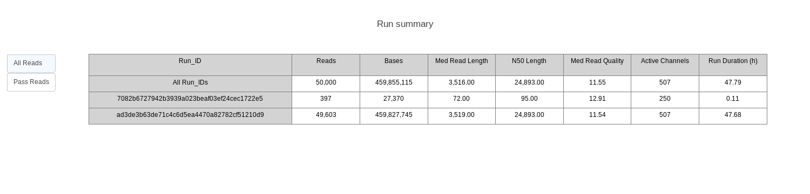
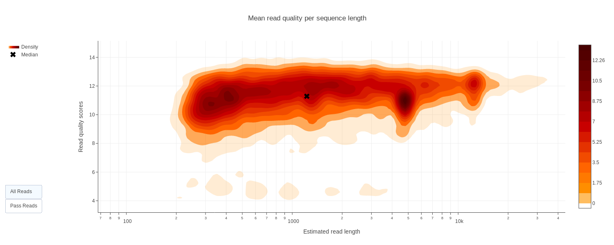
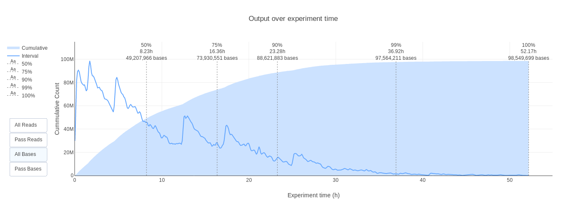
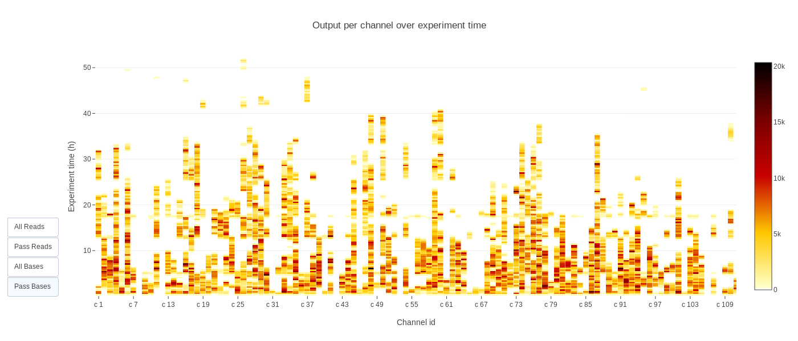

# Summary

Nanopore sequencing of nucleic acids took nearly 30 years to develop and is now firmly established as an alternative to sequencing by synthesis methods [@deamer_three_2016]. Oxford Nanopore Technologies (ONT) released the first commercial nanopore device for DNA sequencing in 2014 and has continually improved the technology since then [@jain_oxford_2016]. Although the read accuracy is only around 90%, ONT technology can sequence very long molecules and generates data in real time. In addition, RNA can be sequenced directly and modified bases can be detected [@garalde_highly_2018].

The electrical signal acquired by the array of nanopores is stored in HDF5 format, with one file (called FAST5) per molecule sequenced. The signal is then converted into a nucleic acid sequence using basecalling software. There are several alternatives, but the best performers for read accuracy are Albacore or Guppy developed and maintained by ONT [@ryan_wick_comparison_2018]. Both can generate FASTQ files, FAST5 files containing basecalling information and a text summary file. Although ONT recently released best-practice guidelines for quality control analysis of sequencing runs [@oxford_nanopore_technologies_bioinformatics_2019], it did not provide a turnkey solution to explore the sequencing data quality in depth.

Here we present pycoQC, a new tool to generate interactive quality control metrics and plots from basecalled nanopore reads or summary files generated by Albacore and Guppy. Although there are other open-source alternatives such as Nanoplot [@de_coster_nanopack_2018], MinionQC [@lanfear_minionqc_2018] and toulligQC [@berengere_laffay_toulligqc_2018], pycoQC has several novel features:

- Integration with the plotly Python charting library to create dynamic D3.js visualizations [@plotly_technologies_inc_plotly_2015].
- Extensive Python API developed for interactive data exploration in Jupyter Notebooks [@jupyter_project_and_community_jupyter_2019] ([example notebook](https://a-slide.github.io/pycoQC/pycoQC_usage.html)).
- Simple command line interface to generate customizable interactive HTML reports ([example report](https://a-slide.github.io/pycoQC/data/output/Albacore-2.3.1_basecall-1D-RNA_pycoQC.html)).
- Multiprocessing FAST5 feature extraction program to generate a summary file directly from FAST5 files.
- Support for data generated by ONT MinION, GridION and PromethION devices, basecalled by Albacore 1.3+, Guppy 2.1.3+ or MinKNOW 18.12+.

# Principle and example output

Briefly, pycoQC imports, filters and preprocesses one or several summary files generated with one of the previously mentioned basecallers. Alternatively, the input file can also be generated with the companion program `Fast5_to_seq_summary` included with the package. If available, calibration strand and barcoding information are also extracted either from the summary file (Albacore) or from a separate barcoding summary file (Guppy). Then, a range of plots and tables can be generated to explore the data. pycoQC plots are interactive, allowing users to display all the reads or only those above the quality threshold, to zoom in and to hide legend labels. The command line interface offers a simple and straightforward experience. On the other hand, the Python API for Jupyter notebook gives more flexibility to users who can easily customise and share their analyses. Example static versions of a selection of the tables and plots produced by pycoQC are presented in Figures 1 to 4.

*Figure 1) Sequencing run summary statistics obtained with the `summary` function. On top of the overall run results, a breakdown per run ID is also displayed. pycoQC counts the number of bases and reads sequenced as well as the number of active channels and the run duration. In addition, the median read length, median read quality and the [N50 score](https://en.wikipedia.org/wiki/N50,_L50,_and_related_statistics#N50) are also computed.*

*Figure 2) 2D density plot of the read length compared with the mean read PHRED quality generated with the `reads_len_qual_2D` function. This visualisation offers a quick overview of reads quality/length and allows the easy identification of read subpopulations. Read length and mean quality can also be explored independently using the 1D density plot functions `reads_len_1D` and `reads_qual_1D`*.

*Figure 3) Read and base output over experiment time obtained with the `output_over_time` function. Both the cumulative and interval yields are displayed together with time points at which 50%, 75%, 90%, 99% and 100% of the reads/bases were sequenced. Users can also follow the evolution of read length and read quality with the `len_over_time` and `qual_over_time` functions.*

*Figure 4) Yield over time per individual channel generated with the `channels_activity` function. Although the visualisation does not directly provide information about the flowcell layout, it gives a good overview of the heterogeneity of channels activity at runtime*

# Availability

pycoQC is available at https://github.com/a-slide/pycoQC together with extensive documentation and some example Jupyter notebooks. The source code has been archived on Zenodo with the linked DOI: [10.5281/zenodo.1116396](https://doi.org/10.5281/zenodo.1116396)

# Acknowledgements

The authors would like to thank Paulo Amaral, who generated most of the datasets provided as example data with pycoQC as well as Tomas Fitzgerald, Jack Monahan and Michael Clark who beta-tested the package and suggested new features. In addition we would also like to thank Kim Judge, Daan Verhagen and Jon Sanders for providing us with summary sequencing files used to develop and test the package. Finally, we thank Ewan Birney for reviewing the paper draft and Tony Kouzarides for providing funding for Tommaso Leonardi. Adrien Leger is supported by a fellowship co-funded by EMBL and the ERC Marie Curie Actions program.

# References
